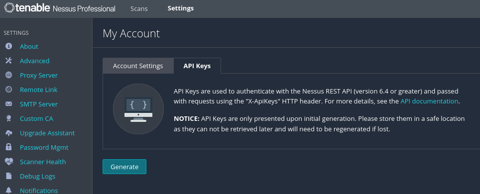

# Nessus Plugin Extractor & Analyzer

A Python CLI tool for querying a local Nessus Professional instance, extracting plugin data, and exporting it in multiple formats.

### 🚀 Features
- 🔍 Search plugins by name using advanced boolean logic:
  - Supports AND, OR, NOT, and parentheses
- 🎯 Direct plugin lookup using plugin IDs
- ⚡ Multithreaded fetching for fast data retrieval
- 🔐 Flexible authentication
  - CLI arguments
  - Environment variables
- 📄 Multiple output formats
  - JSON (full data)
  - CSV (structured + dynamic attributes)
  - TXT (flat CVE list)
- 🧠 Dynamic CSV columns
  - Automatically includes all Nessus plugin attributes
- 🔇 Suppress SSL warnings with -k
- 🧩 Works with inconsistent Nessus API responses (robust parsing)

## 📦 Requirements
- Python 3.8+
- requests

Install dependencies:
```
pip install requests
```

## 🔐 Authentication

You can authenticate in two ways:

### 1. CLI Arguments
```
--access-key YOUR_ACCESS_KEY
--secret-key YOUR_SECRET_KEY
```
or
```
--token YOUR_SESSION_TOKEN
```

### 2. Environment Variables (Recommended)
```
export nessus_access_key="YOUR_ACCESS_KEY"
export nessus_secret_key="YOUR_SECRET_KEY"
```
OR
```
export nessus_api_token="YOUR_TOKEN"
```

CLI arguments take precedence over environment variables.

An Access Key and Secret Key can be obtained from the Nessus UI:


## 🧠 Modes of Operation
### 1. Expression Search Mode

Search plugin names using boolean logic.
```
--expr '("Windows Server" AND 2016) AND NOT 2019'
```

#### Suppported Operators
| Operator | Description           |
| -------- | --------------------- |
| AND      | Both terms must match |
| OR       | Either term matches   |
| NOT      | Excludes term         |
| ()       | Grouping              |

#### Examples
```
--expr "Windows AND 2016"
--expr "KB5075999 OR KB5073722"
--expr "(Windows AND Server) AND NOT 2019"
```

### 2. Direct Plugin ID Mode

Skip searching and fetch specific plugins:
```
--plugin-id 298556
```
Multiple IDs:
```
--plugin-id 298556,283466,270384
```

## 📤 Output Options

`--out / -o`
Comma-separated list of output formats:
```
json,csv,txt
```

| Type | Description                           |
| ---- | ------------------------------------- |
| json | Full Nessus plugin JSON               |
| csv  | Structured output with all attributes |
| txt  | Flat list of CVEs (one per line)      |
***
`--filename / -f`
Single base filename used for all outputs.
```
--filename results
```
Produces:
```
results.json
results.csv
results.txt
```

#### Default Behavior
If `--out` is not specified:
- No files are written
- Results are printed to stdout

### 📊 CSV Output Details

The CSV includes:

Fixed Columns
PluginID
PluginName
ReportedCVEs
CVSSv3_RiskFactor
CVSSv3_BaseScore
CVSSv3_ScoreSource
ReferenceURL
Dynamic Columns

Every attribute_name returned by Nessus becomes a column.

Example:

cve, cvss3_base_score, synopsis, solution, plugin_type, etc.

Values are:

Semicolon-separated
Deduplicated
📄 TXT Output
Contains all CVEs across all matched plugins
One CVE per line
Deduplicated

Example:

CVE-2026-12345
CVE-2025-54321
...
⚡ Performance
Uses ThreadPoolExecutor
Default: --workers 6

Adjust as needed:

--workers 10
🔒 SSL Handling

Use -k to disable SSL verification:

-k

This will:

Skip certificate validation
Suppress InsecureRequestWarning
🧪 Examples
Example 1: Search + All Outputs
python tool.py \
  --expr '(Windows AND 2016) AND NOT 2019' \
  --out json,csv,txt \
  --filename results \
  -k
Example 2: Direct Plugin Lookup
python tool.py \
  --plugin-id 298556,283466 \
  --out csv \
  --filename plugins \
  -k
Example 3: Using Environment Variables
export nessus_access_key=XXX
export nessus_secret_key=YYY

python tool.py \
  --expr "KB5075999" \
  --out json \
  -f output \
  -k
⚠️ Notes
Nessus API endpoints can vary slightly between versions — this tool includes fallback logic.
Some plugin fields may appear multiple times — values are merged and deduplicated.
Large searches can take time depending on:
Number of plugin families
Thread count
Network latency
